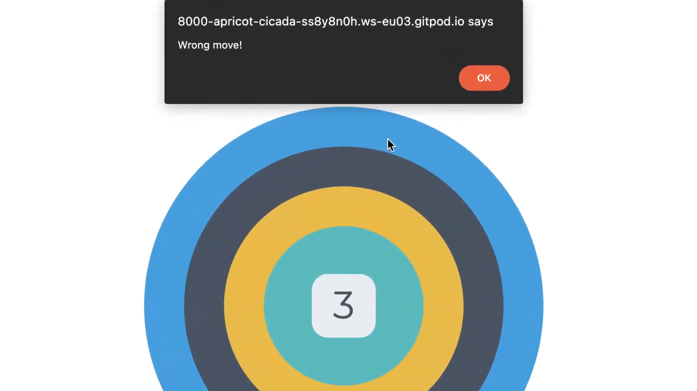

# Simon game With Jest Testing

## Live link is here - [Simon game](https://cam-4587.github.io/Simon_game_Jest_Walkthrough/)

- This is a walkthrough project from the Code Institute's Full stack development course. It looks to create a game using **JEST** to follow Test Driven development principles.

- This game is based on the Electronic Simon game from the 1980s.

- It is  a memory game where the circles will flash in a sequence and you have to click to circles in the correct sequence.

- If you get it right you get a point and move onto the next round.

- If you fail to get the sequnce then the game will tell you you have got a wrong move and the game will restart automatically.

    

- The game engine is built using **JEST** to make sure everything works as excepted.

- **JavaScript Functions**:
  - `newGame()`: Initializes a new game by resetting the game state and setting up event listeners for the game buttons.
  - `addTurn()`: Adds a new move to the game's sequence and calls `showTurns()` to display the sequence.
  - `showTurns()`: Displays the sequence of moves to the player using a timed interval.
  - `lightsOn(circ)`: Lights up a specific button and then turns it off after a short delay.
  - `playerTurn()`: Handles the player's input, checks if the moves are correct, updates the score, and adds new turns if the sequence is correctly followed.
  - `showScore()`: Updates the displayed score.

- The game object and all of these functions are exported at the bottom of the document and imported at the top of the testing document.

- A before all function is used to load the add the contents of your index.html into your mock DOM to set up your DOM before all of your tests are run.

- **JavaScript Tests**:
- A describe "pre game" function contains a Test for checking that clicking buttons before starting a new game does not register any moves.

- A describe "game object contains correct keys" function containing tests to verify that the game object contains all the required keys and that they have correct initial values.

- A describe "newGame works correctly" function containing tests to test that the newGame function correctly resets the game state, sets up event listeners, and updates the score display. This describe function uses a beforeAll function to simulate a game state before resetting the game with the newGame function.

- A describe "gameplay works correctly" function contains both a before each and after each function to set the game state to an unplayed game both before and after each test. The tests within this function test for various functionalities like adding new moves, making buttons light up, showing the sequence of moves and handling the player's moves.

- A spy or a Mock function is used to mock a windows alert which is later used when testing the calling of an alert if the incorrect circle is selected by the user.

